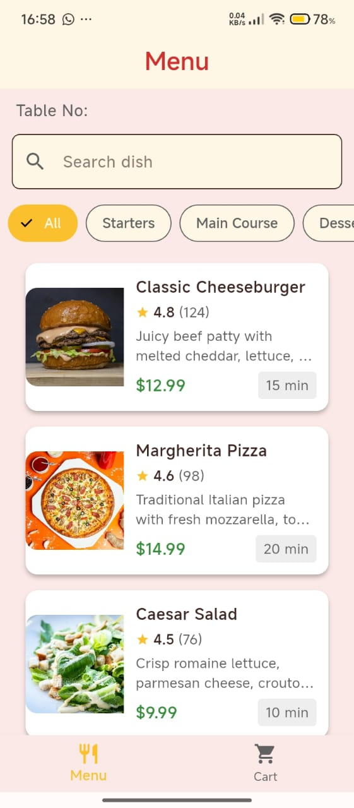
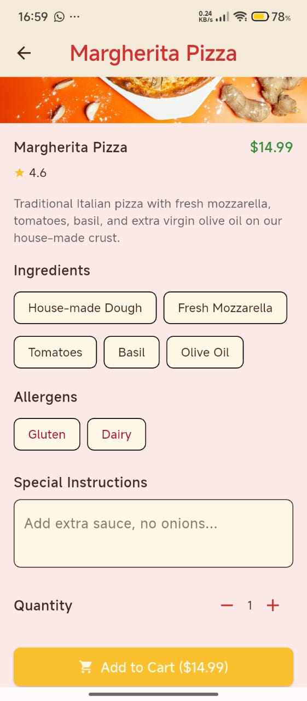
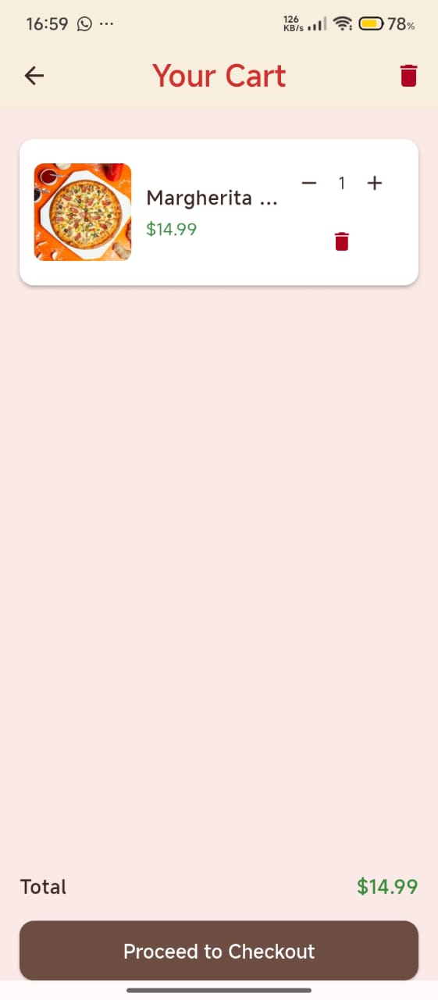
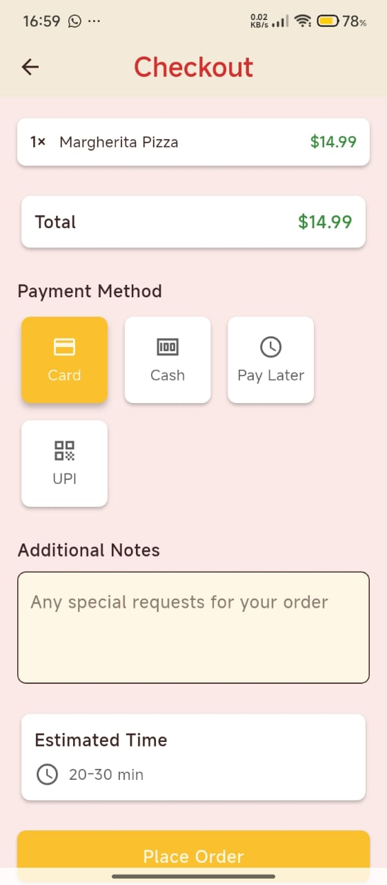

# 🍽️ SwiftDine

**SwiftDine** is a digitized restaurant menu and ordering system designed to eliminate delays in food service. Inspired by real-life frustration with long wait times, SwiftDine empowers diners to browse menus, place orders, and make payments — directly from their mobile devices.

---

## ✨ Features

- 🧾 **Digital Menu**
  - Browse meals by category
  - Smooth horizontal scrolling for category filters
  - Dynamic theming with `ThemeData` (Light & Dark)
    

- 🛒 **Cart System**
  - Add or remove items with quantity adjustments
  - View total cost in real-time
    

- 🔍 **Item Detail View**
  - Full descriptions, images, and prices of menu items
    

- 🎨 **Modern UI/UX**
  - Clean, responsive layout
  - Animated splash screen
  - Custom `AppTheme` implementation
    

- 💳 **Upcoming Integrations**
  - M-Pesa & Stripe for secure payments
  - Spring Boot backend for order processing & analytics
  - QR code-based table scanning

---

## 📱 Screenshots

| Splash Screen                     | Menu Screen                   | Item Detail                                 |  Cart                     | checkout Screen                 |
| --------------------------------- | ----------------------------- | ------------------------------------------- | ----------------------------- |-----------------------------
|  |  |  |  |  |

---

## 🚀 Getting Started

### 📦 Prerequisites

- Flutter SDK (v3.10+ recommended)
- Dart SDK
- Android Studio or VSCode
- Android emulator or physical device

### 🛠️ Installation

bash
# Clone the repository
git clone https://github.com/semedo-nob/swiftdine.git
cd swiftdine

# Install dependencies
flutter pub get

# Run the app
flutter run

✨ Key Features
🧾 Menu Browsing

Clean categories & scrollable UI

Fast filtering and item discovery

🔍 Item Detail View

Dynamic price calculation based on quantity

Add to cart directly with visual feedback

🛒 Cart & Checkout

Real-time total updates

Simple cart management

Integration-ready for M-Pesa & Stripe

💡 Theming

Harmonized light & dark themes via AppTheme

🚀 Performance

Optimized for fast scrolling & minimal jank

Efficient rendering of menus and items

🔒 Payment & Backend (Coming)
🏦 M-Pesa & Stripe integration (via API)

🧠 Spring Boot backend for:

Order handling

Inventory

Restaurant analytics

👨‍💻 Developer
Nelson Apidi
📧 nelsonapidi75@gmail.com
🔗 GitHub: @semedo-nob

📄 License
MIT License. Free for personal and commercial use.

SwiftDine was born from a simple moment of frustration while waiting in a hotel — now it's here to make dining smooth, digital, and swift.
